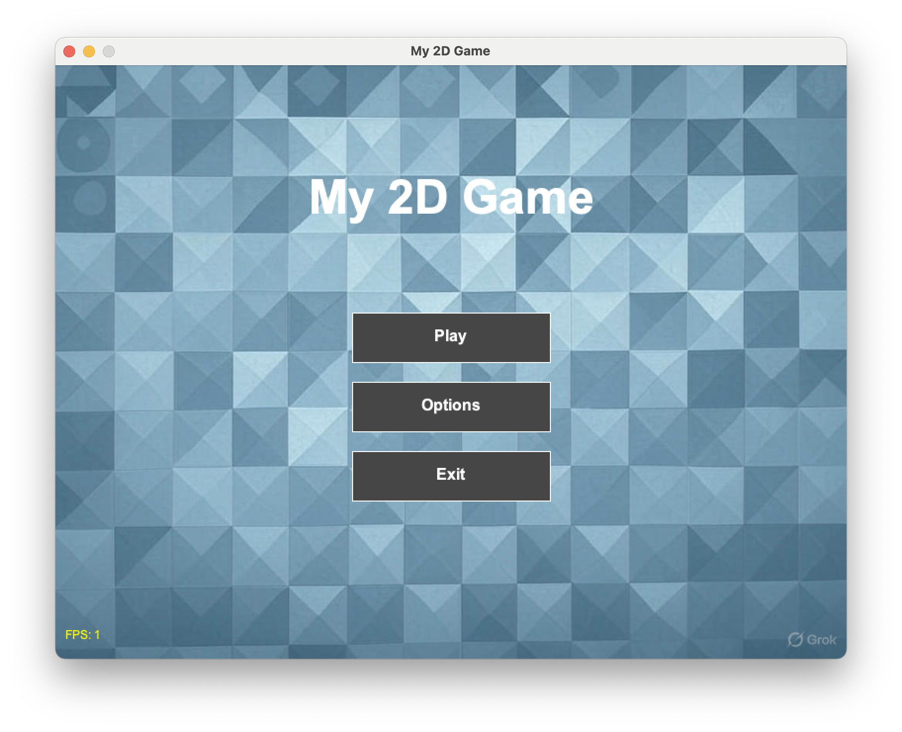

# TENET: A Temporal Paradox Puzzle Game

[](https://opensource.org/licenses/MIT)
[](https://www.oracle.com/java/technologies/javase/jdk17-archive-downloads.html)
[](https://gradle.org/)
[](https://www.java.com/)
[](https://github.com/KnobNA/2d)
[](https://apcentral.collegeboard.org/courses/ap-computer-science-a)

**TENET** is a 2D top-down puzzle game that explores temporal mechanics through a novel time manipulation system. Players navigate dungeon levels under a 60-second constraint, using a recording and playback mechanism that allows simultaneous interaction between past and present timelines—creating puzzles that require thinking across multiple temporal dimensions.



## Core Mechanic: Temporal Recording and Playback

The game's central innovation lies in its temporal recording system. Players can initiate a recording phase that captures all movements, button activations, and object interactions at discrete timestamps. Upon stopping the recording, time rewinds to the recording's start point, and a "ghost" timeline replays those exact actions while the real player simultaneously executes new commands in the present timeline.

This creates a unique puzzle-solving paradigm where players must:
- **Decompose complex sequences** into orchestrated actions across past and present versions of themselves
- **Visualize causal dependencies** between past-timeline actions and present-timeline navigation
- **Plan temporally** by reasoning about how recorded actions will interact with future moves

## Scientific and Mathematical Foundations

### 1. State Space Management

The game implements a comprehensive state capture system that records:
- **Player state**: Position `(x, y)` in 2D Euclidean space
- **Object states**: Box positions, button activation states, door states
- **Temporal metadata**: Timestamps for each recorded action

**Data Structure**: The `RewindManager` uses a combination of:
- `List<RecordedAction>` for chronological action storage
- `Map<Box, List<BoxPositionRecord>>` for efficient position history lookup (O(1) average case)
- `Map<String, Boolean>` for toggle state tracking with hash-based lookups

**Complexity Analysis**:
- Recording: O(1) per frame for state capture
- Replay: O(n log n) for action sorting, O(n) for replay execution where n = number of recorded actions
- Position interpolation: O(m) where m = number of position records per object

### 2. Temporal Event Scheduling

Actions are recorded with millisecond-precision timestamps relative to recording start time. During replay, the system uses a **time-ordered event queue**:

```java
Collections.sort(recordedActions, Comparator.comparingLong(a -> a.timestamp));
```

This ensures deterministic replay order, critical for maintaining causal consistency across timelines.

**Mathematical Model**: Each action `a_i` has a timestamp `t_i` such that:
- Recording phase: `t_i = currentTime - recordingStartTime`
- Replay phase: Action `a_i` executes when `currentRelativeTime ≥ t_i`

### 3. Vector Mathematics and Collision Detection

The game uses a custom `Vector2D` class implementing:
- **Vector addition/subtraction**: For position updates
- **Scalar multiplication**: For velocity scaling
- **Magnitude calculation**: `||v|| = √(x² + y²)` for normalization
- **Normalization**: `v̂ = v/||v||` for diagonal movement correction

**Collision Detection Algorithm**:
- Uses axis-aligned bounding box (AABB) collision detection
- Implements **separating axis theorem** for 2D rectangles
- Collision bounds are 90% of entity size to prevent edge-case collisions: `collisionWidth = width × 0.9`

**Coordinate Transformations**:
- Grid-to-screen: `screenX = gridX × cellSize`
- Screen-to-grid: `gridX = screenX ÷ cellSize`
- Enables discrete spatial reasoning while maintaining smooth movement

### 4. Causal Dependency Tracking

The system maintains a **causal graph** of dependencies:
- Button activations → Door state changes
- Box movements → Weighted button activations
- Past-timeline actions → Present-timeline object states

**Implementation**: Uses a state machine tracking:
- Initial states: `Map<String, Boolean>` for toggle/door states
- Current states: Updated during replay
- Final states: Synchronized after replay completion

This ensures that actions performed by the "ghost" player in the past timeline correctly affect objects in the present timeline, maintaining temporal causality.

### 5. Position Interpolation and Temporal Continuity

For smooth object movement during replay, the system implements **temporal position interpolation**:

```java
BoxPositionRecord currentRecord = findRecordAtTime(t);
box.setX(currentRecord.x);
box.setY(currentRecord.y);
```

The algorithm searches the position history using a **binary search-like approach** (O(log m) for sorted lists) to find the appropriate position record for the current replay time.

### 6. Grid-Based Spatial Partitioning

The `GridSystem` implements a **spatial hash** for efficient entity lookup:
- Grid cells: `horizontalCells × verticalCells` partition of screen space
- Entity storage: `HashMap<String, Entity>` with key `"gridX,gridY"`
- Lookup complexity: O(1) average case for entity retrieval

This enables efficient collision detection by limiting checks to relevant grid cells rather than all entities.

## Technical Architecture

### Project Structure

```
app/
├── src/
│   ├── main/
│   │   ├── java/
│   │   │   └── com/niravramdhanie/twod/game/
│   │   │       ├── core/         # Game loop, state management
│   │   │       ├── entity/       # Game entities (player, boxes, buttons, doors)
│   │   │       ├── graphics/     # Rendering and animation
│   │   │       ├── input/        # Keyboard and mouse input
│   │   │       ├── level/        # Level generation and management
│   │   │       ├── state/        # Game state machine
│   │   │       ├── ui/           # User interface components
│   │   │       └── utils/        # Utilities (RewindManager, GridSystem, Vector2D, TimerManager)
│   │   └── resources/            # Game assets
│   └── test/                     # Unit tests
└── build.gradle                  # Gradle build configuration
```

### Key Components

**RewindManager** (`utils/RewindManager.java`):
- Implements the temporal recording and playback system
- Manages state capture, action replay, and causal dependency tracking
- Handles position interpolation for smooth object movement

**GridSystem** (`utils/GridSystem.java`):
- Spatial partitioning system for efficient entity management
- Coordinate transformation between grid and screen space
- O(1) entity lookup using hash-based storage

**Vector2D** (`utils/Vector2D.java`):
- 2D vector mathematics for position and velocity calculations
- Supports addition, subtraction, scalar multiplication, normalization

**TimerManager** (`utils/TimerManager.java`):
- Discrete-time countdown timer with second-precision
- State preservation during temporal rewinding

## Algorithmic Highlights

### Action Replay Algorithm

1. **Recording Phase**:
   - Capture initial state: `S₀ = {playerPos, timer, buttonStates, boxStates}`
   - For each frame: Record actions with timestamp `t_i`
   - Store in chronological list: `A = [a₁(t₁), a₂(t₂), ..., aₙ(tₙ)]`

2. **Rewind Phase**:
   - Reset state to `S₀`
   - Sort actions by timestamp: `A' = sort(A)` (O(n log n))
   - For each frame at time `t`:
     - Apply all actions where `t_i ≤ t` and `applied = false`
     - Update object positions via interpolation
   - Synchronize final states

### Collision Detection Algorithm

For each entity movement:
1. Calculate new position: `newPos = currentPos + velocity × Δt`
2. Check AABB collision with all relevant entities
3. If collision detected:
   - Resolve along axis of movement
   - Set velocity component to 0
   - Adjust position to collision boundary

**Optimization**: Only check collisions with entities in adjacent grid cells, reducing complexity from O(n²) to O(k) where k = entities per cell.

## Design Philosophy

Each puzzle requires players to think **causally across multiple timelines**—decomposing complex switch sequences into orchestrated actions across past and present versions of themselves. Success demands both **spatial reasoning** (navigating the 2D grid) and **temporal planning** (visualizing how recorded actions will interact with future moves).

The project demonstrates how abstract game mechanics translate into concrete data structures and algorithms, and how seemingly impossible gameplay concepts become tractable through careful system design.

## Prerequisites

- Java JDK 17 or higher
- Gradle 7.4 or higher (or use the included Gradle wrapper)

## Installation and Setup

1. Clone the repository:
   ```bash
   git clone https://github.com/vramdhanie/nirry_2d.git
   cd nirry_2d
   ```

2. Build the project:
   ```bash
   ./gradlew build
   ```

3. Run the game:
   ```bash
   ./gradlew run
   ```

## Controls

- **Arrow Keys / WASD**: Move player
- **Space / E**: Interact with buttons/boxes
- **R**: Toggle recording/rewind (start recording → stop recording and rewind)

## Performance Characteristics

- **Frame Rate**: 60 FPS target with consistent update loop
- **Memory Complexity**: O(n + m) where n = entities, m = recorded actions
- **Time Complexity**: 
  - Recording: O(1) per frame
  - Replay: O(n log n) for sorting + O(n) for execution
  - Collision detection: O(k) per entity where k = entities per grid cell

## Mathematical Concepts Applied

1. **Linear Algebra**: Vector operations for movement and physics
2. **Discrete Mathematics**: Graph theory for causal dependencies
3. **Algorithms**: Sorting, searching, spatial partitioning
4. **Data Structures**: Lists, hash maps, priority queues
5. **Computational Geometry**: AABB collision detection, coordinate transformations
6. **State Machines**: Temporal state management (IDLE → RECORDING → REWINDING)

## Future Enhancements

Potential extensions for further mathematical exploration:
- **Multiple simultaneous timelines**: Managing k parallel timelines
- **Temporal paradox resolution**: Handling conflicting causal chains
- **Optimization algorithms**: Finding minimal-action solutions
- **Formal verification**: Proving temporal consistency properties

## License

MIT License

Copyright (c) 2023 Vincent Ramdhanie

Permission is hereby granted, free of charge, to any person obtaining a copy
of this software and associated documentation files (the "Software"), to deal
in the Software without restriction, including without limitation the rights
to use, copy, modify, merge, publish, distribute, sublicense, and/or sell
copies of the Software, and to permit persons to whom the Software is
furnished to do so, subject to the following conditions:

The above copyright notice and this permission notice shall be included in all
copies or substantial portions of the Software.

THE SOFTWARE IS PROVIDED "AS IS", WITHOUT WARRANTY OF ANY KIND, EXPRESS OR
IMPLIED, INCLUDING BUT NOT LIMITED TO THE WARRANTIES OF MERCHANTABILITY,
FITNESS FOR A PARTICULAR PURPOSE AND NONINFRINGEMENT. IN NO EVENT SHALL THE
AUTHORS OR COPYRIGHT HOLDERS BE LIABLE FOR ANY CLAIM, DAMAGES OR OTHER
LIABILITY, WHETHER IN AN ACTION OF CONTRACT, TORT OR OTHERWISE, ARISING FROM,
OUT OF OR IN CONNECTION WITH THE SOFTWARE OR THE USE OR OTHER DEALINGS IN THE
SOFTWARE.

## Acknowledgments

Developed as an AP Computer Science A final project exploring temporal mechanics in game design. The name "TENET" references Christopher Nolan's film, reflecting the complexity of explaining temporal paradoxes.
